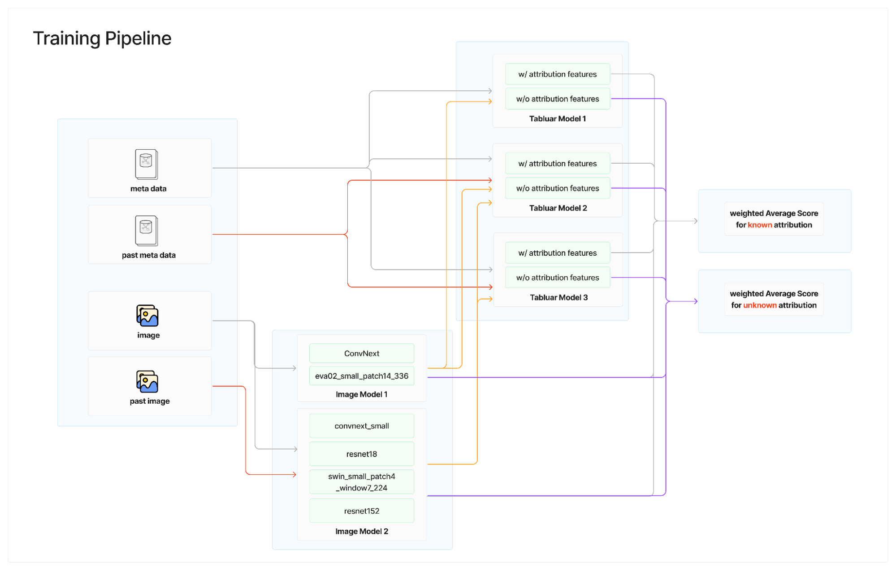

# 5th Place Winning Solution - ISIC 2024 - Skin Cancer Detection with 3D-TBP

This is the repository of part of 5th winning solution of "ISIC 2024 - Skin Cancer Detection with 3D-TBP" in kaggle. https://www.kaggle.com/competitions/isic-2024-challenge/discussion/533056




This repository contains `Tabular Model 3` in the pipeline above.

## Setup
Make sure to place the required file in the following directory structure

 ```bash
project-root/
├── input/
│   └── isic-2024-challenge/
│       └── past_metadata.csv
│       └── sub_71/
│       └── sub_73/
│       └── sub_75/
│       └── sub_77/
```

- past_metadata.csv
    - https://www.kaggle.com/datasets/tomooinubushi/all-isic-data-20240629?select=metadata.csv
- sub_71 ~ 77
    - out-of-fold prediction files of image models
    - https://www.kaggle.com/datasets/toseihatori/isic-2024-sub-models

## How to Run

### 1. Launch jupyter on kaggle-gpu-images docker
```bash
$ docker compose up
```

### 2. run notebooks
```
src\exp33_no_attribution.ipynb
src\exp33.ipynb
```
